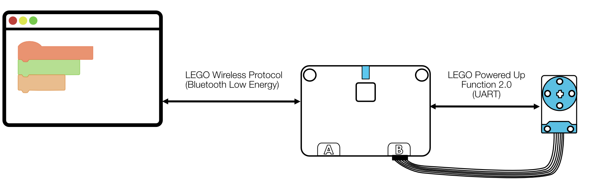
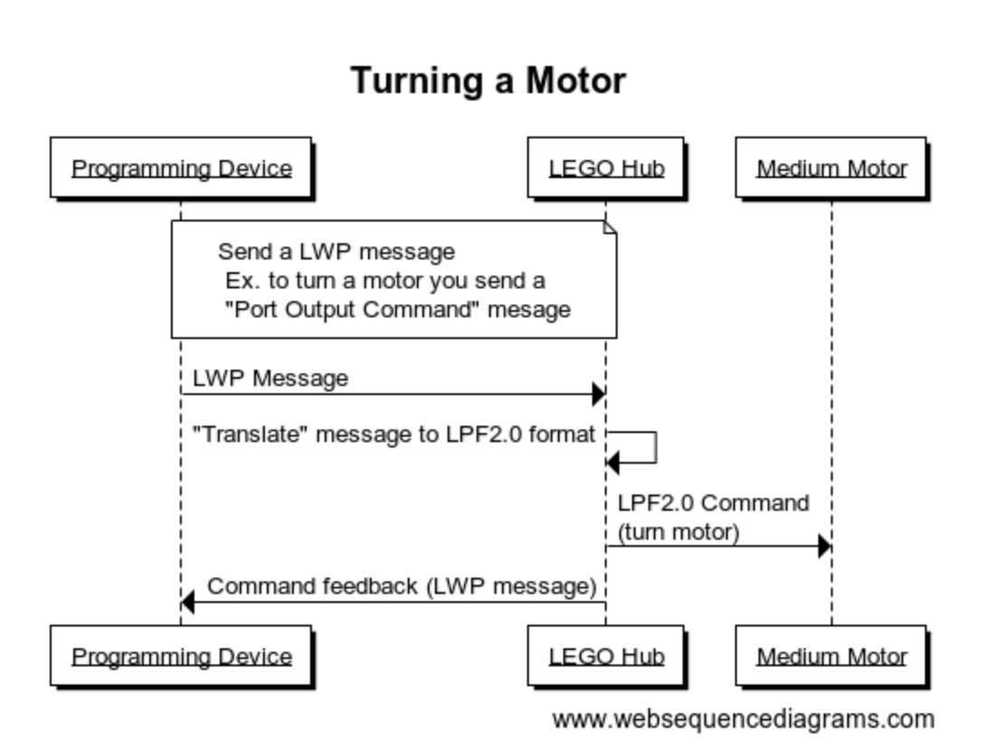

# Introduction
(Introduction to LEGO protocols contributed by: [ErikMejerHansen](https://github.com/ErikMejerHansen))

There are a couple of protocols in play:
* LEGO Wireless Protocol (usually abbreviated to LWP)
* and LEGO Powered Up Functions 2.0 (usually abbreviated to LPF2.0).

LWP is used for the communication between the programming device (Browser, LEGO APP, etc) and a LEGO programmable brick (often called LEGO Hubs for short). LWP uses Bluetooth Low Energy as the transport layer. 

LPF2.0 is used between the LEGO Hub and anything attached to it (motors, sensors, etc). 



So in broad terms the flow for turning a motor from a programming device (like Livebook or official LEGO App) would look something like this:
1. The programming device sends a "turn motor" message in LWP format over BLE to the LEGO Hub.
1. The Hub translates that command into LPF2.0 messages and sends them over the wires to the Motor.
1. The LEGO Hub sends a command feedback (motor command completed, motor stalled, etc) message in LWP format back to the programming device.



Unfortunately, there are some shortcomings and the elements are not as standard as in classic LEGO bricks, where everything just fits together perfectly.

Things you plug into LEGO Hubs (motors, sensors, etc) should talk LPF2.0, but not all Hubs understand all devices.

LEGO Boost (now called MoveHub), LEGO SPIKE Essential, LEGO Duplo Trains all understand LWP. 

LEGO Mindstorms uses its own JSON based protocol.

LEGO SPIKE Prime uses its own proprietary binary protocol.

# Installation

## Raspberry Pi OS

Install dependencies
```
sudo apt-get install build-essential autoconf libncurses5-dev openssl libssl-dev fop xsltproc git
```

Install GUI dependencies
```
sudo apt-get install libwxbase3.2-1 libwxgtk3.2-dev libwxgtk-webview3.2-dev
```

Install `asdf`
```
git clone https://github.com/asdf-vm/asdf.git ~/.asdf
```

Open `.bashrc` file with `nano ~/.bashrc` and append these lines to the end
```
. “$HOME/.asdf/asdf.sh”
. “$HOME/.asdf/completions/asdf.bash”
```

Install Erlang and Elixir
```
asdf plugin add erlang
asdf plugin add elixir
asdf list-all erlang
export KERL_CONFIGURE_OPTIONS="--without-javac --without-odbc"
asdf install erlang 27.0.1
asdf global erlang 27.0.1
asdf install elixir 1.17.2-otp-27
asdf global elixir 1.17.2-otp-27
```

Install Livebook
```
mix do local.rebar --force, local.hex --force
mix escript.install hex livebook
asdf reshim elixir
```

Start Livebook server listening on a local network IP address
```
LIVEBOOK_TOKEN_ENABLED=false LIVEBOOK_IP=<Raspberry.Pi.IP.Address> livebook server
```

See all the configuration options
```
livebook server --help
```
